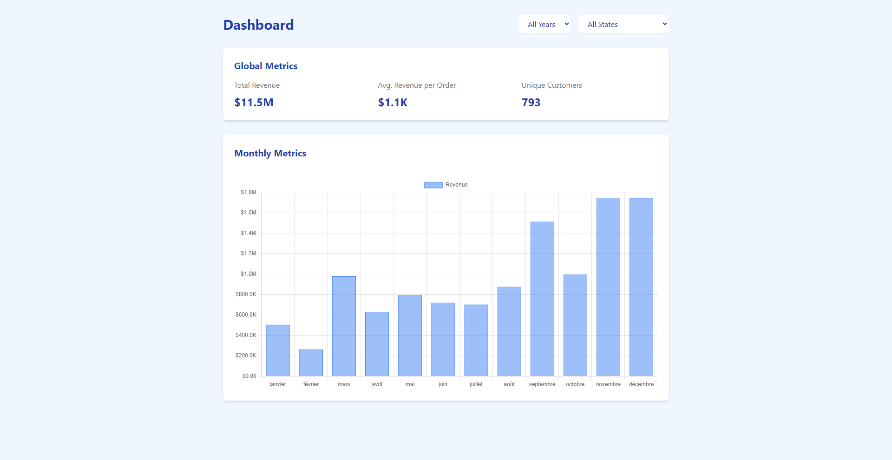

# dashboard-csv-parser

## Overview 

This project is a frontend application that fetches data from an API to display three key metrics and a histogram chart. The application is built using React (typescript) and Tailwind CSS for styling.

## Features

- **Metrics Display:** Shows total revenue, average revenue per order, and unique customers.
- **Histogram Chart:** Visual representation of monthly metrics.
- **Dynamic Filtering:** Allows filtering data by year and state.

---

## API CSV Parser

The corresponding API is available in a separate repository. You can find it here: [API CSV Parser](https://github.com/AgurSan/api-csv-parser)

### Description

API CSV Parser provides a RESTful API for parsing CSV files and extracting metrics from the data.
